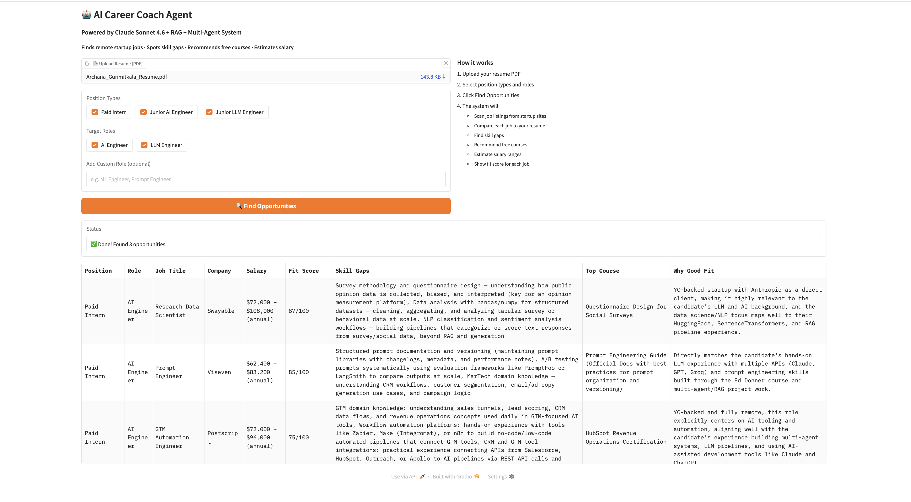

# AI Career Coach Agent

An agentic AI system that finds remote startup jobs, spots skill gaps, recommends free courses, and estimates salary — powered by Anthropic Claude Sonnet 4.6.

## Built With Claude

This project uses the [Anthropic Claude API](https://www.anthropic.com) (Claude Sonnet 4.6) as the core intelligence behind every agent:

- **Job filtering** — Claude reads job listings and picks the best matches for your background
- **Skill gap analysis** — Claude compares your resume to job requirements using RAG
- **Course recommendations** — Claude suggests free courses for each missing skill
- **Salary estimation** — Claude estimates pay ranges and fit score using adaptive thinking
- **Adaptive thinking** — Claude Sonnet 4.6 reasons deeply before estimating salaries

## Demo

Upload your resume, get matched to AI/LLM jobs at startups, see skill gaps, free courses, and salary estimates.



## Architecture

```
rag/
  embedder.py           → converts text to vectors (SentenceTransformers)
  vector_store.py       → stores and searches resume chunks (ChromaDB)
  ingest.py             → reads PDF resume and stores in ChromaDB

agents/
  job_scanner_agent.py  → finds jobs from RSS feeds, Claude filters best matches
  skill_gap_agent.py    → RAG + Claude compares resume to job requirements
  learning_agent.py     → Claude recommends free courses for each gap
  salary_agent.py       → Claude estimates salary and fit score (0-100)
  alert_agent.py        → sends top matches via Pushover notification
  planner_agent.py      → orchestrates all agents in order

ui/
  app.py                → Gradio web interface
```

## Tech Stack

| Tool | Purpose |
|------|---------|
| Anthropic Claude Sonnet 4.6 | Core AI — job filtering, skill gaps, salary, courses |
| ChromaDB | Vector store for resume chunks |
| SentenceTransformers | Local embeddings (free, no API cost) |
| Gradio | Web UI |
| feedparser | RSS job feeds (RemoteOK, WeWorkRemotely) |
| Pushover | Phone notifications (optional) |
| ThreadPoolExecutor | Parallel job searches |

## Setup

```bash
# 1. Clone the repo
git clone https://github.com/yourusername/ai-career-coach-agent
cd ai-career-coach-agent

# 2. Install dependencies
pip install -r requirements.txt

# 3. Add your Anthropic API key
cp .env.example .env
# Edit .env and add your ANTHROPIC_API_KEY

# 4. Run the app
python3 ui/app.py

# 5. Open browser
# http://localhost:7860
```

## How It Works

1. Upload your resume PDF
2. Select position types (Paid Intern / Junior AI Engineer / Junior LLM Engineer)
3. Select target roles (AI Engineer / LLM Engineer)
4. Click Find Opportunities

The system will:
- Scan job listings from AI/ML startup job boards
- Compare each job to your resume using RAG
- Find skill gaps using Claude (only real gaps, not things you already know)
- Recommend free courses for each gap
- Estimate salary range and fit score (0-100) using Claude with adaptive thinking
- Show results sorted by fit score

## Target Jobs

- Remote-first startups (California-based or fully remote)
- Companies building with Claude, Cursor, ChatGPT in their daily workflow
- Positions: Paid Intern, Junior AI Engineer, Junior LLM Engineer

## Environment Variables

```
ANTHROPIC_API_KEY=your_claude_api_key   # required
PUSHOVER_TOKEN=your_token               # optional - for phone notifications
PUSHOVER_USER=your_user_key             # optional - for phone notifications
```

## Built With

Built as a Week 8 capstone project for Ed Donner's LLM Engineering course.
Powered by Anthropic Claude Sonnet 4.6.
